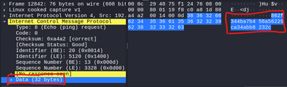

    *Disclaimer*

    This tool is for educational and authorized security assessments only. Use must comply with all applicable laws.
    By using this tool, you agree:

    - To use it only with proper authorization: It’s for identifying vulnerabilities in systems you own or have explicit permission to assess.
    - To accept full responsibility for your actions: Developers are not liable for misuse, damages, or legal issues.
    - To comply with all laws: Unauthorized use may violate legal regulations. Ensure you understand the implications.

## What is this

A "covert channel" Command and Control framework.
This framework uses the data portion of an ICMP-packet to transmit encrypted data between the server and connected clients.

## Basic flow of the C2

- **Initial key exchange**
	- *Client generates AES key and nonce, encrypts these with server public key*
	- *Sends this to server, which decrypts and stores the AES key and nonce*
	- *Server responds with "INIT OK" -> key exchange successful*

 

- Client checks in with the server by sending "!ping"-command

- If server has a command for us:
	- Execute the command
	- Encrypt the result and split into blocks (by default blocks of size 32 bytes)
   		- Bigger size of blocks -> faster transmission of the result (but bad OPSEC)
	- Send result to server
    	- If server responds with "cancel" during the transmission of the result:
        	- Cancel the transmission
    	- Else:
        	- Continue with the transmission
- Else:
	- Do nothing (sleep for {timeout} seconds)
