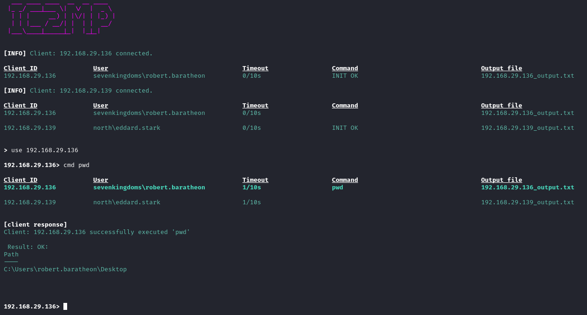

# Command and control over ICMP (Server)

## IMPORTANT

### 1
```sh
python3 generate_keys.py
```
Generates a new private and public key. Replace the private key in [crypto.py](./crypto.py) and public key in [AESHandler.cpp](../Client/AESHandler.cpp).

### 2
```sh
sudo iptables -A OUTPUT -p icmp --icmp-type echo-reply -j DROP
```
Blocks all outgoing ICMP echo-reply packets from the OS. Scapy will handle all ICMP-packets.

### 3

```sh
python3 -m venv myenv
source myenv/bin/activate
pip install -r requirements.txt
sudo ./myenv/bin/python3 main.py
```
This will create a virtual environment, install the required python libraries ([requirements.txt](./requirements.txt)) and start the server. Scapy requires sudo. 

**The server is now waiting for clients to connect** 

<br>
<br>




## Commands
```
  ___ ____ ____  __  __ ____  
 |_ _/ ___|___ \|  \/  |  _ \                                                                                                                                                                                                                                                                                                                                                          
  | | |     __) | |\/| | |_) |                                                                                                                                                                                                                                                                                                                                                         
  | | |___ / __/| |  | |  __/                                                                                                                                                                                                                                                                                                                                                          
 |___\____|_____|_|  |_|_|                                                                                                                                                                                                                                                                                                                                                             
                                                                                                                                                                                                                                                                                                                                                                                       
 
> help
Commands:
- clients                     Show connected clients

- use <IP>                    Select a client (unselect: `use none`)

- cmd <cmd>                   Run a command on the selected client (e.g. 'cmd whoami')
- cmd all <cmd>               Run a command on all connected clients (requires no active client (`use none`))
- cmd cancel                  Cancel the running command
- cmd clear                   Clear the command variable

- delay <seconds>             Change the delay between each packet sent from client (default: 0.5 seconds). Careful not to ICMP-flood the server
- timeout <seconds>           Change the client's sleep time (default: 10 seconds). Careful not to ICMP-flood the server
- updateAES                   Client regenerates AES key and nonce, and sends it back to the server
- info                        Show metadata about the selected client
- blocksize <bytes>           Allowed block size (in bytes) is from 1 up to and including 1472
```


## Todo
- Use SQLite to store data
- Implement stealthy response from server
  - The server should respond to client in blocks of 32 bytes
- Progress bar (feature)
  - Keep track of how many bytes the client has transmitted
  - Client executes the command, and in the first response to the server, client transmits the length of the result
    - Ex: Client executes "cat big.txt" -> Responds to server with total bytes of the encrypted text -> Starts transmission
  - Then server updates the progress bar (bytes received from client / total length of result)
  
## Bugs
- Plenty